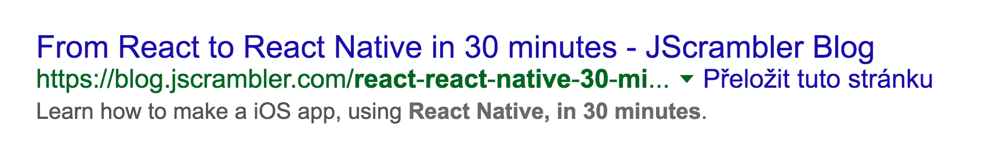
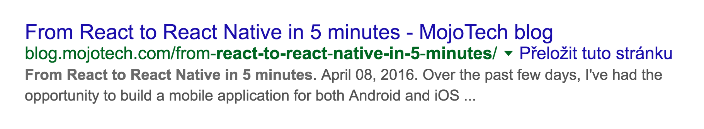
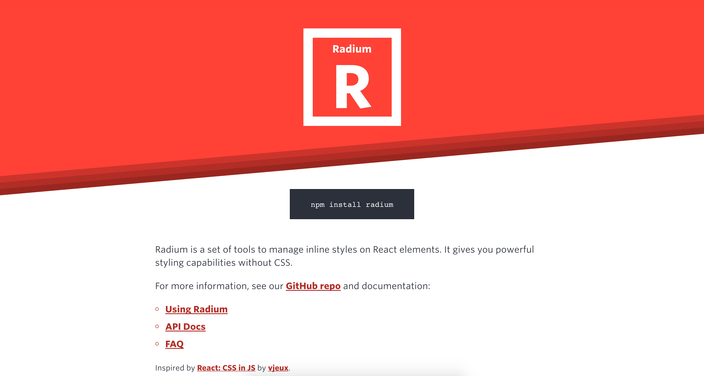
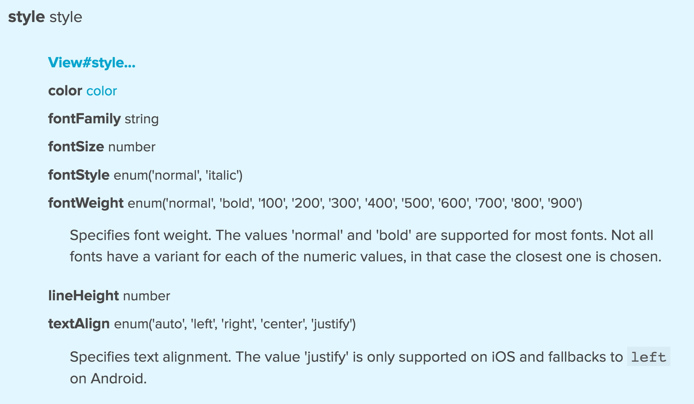
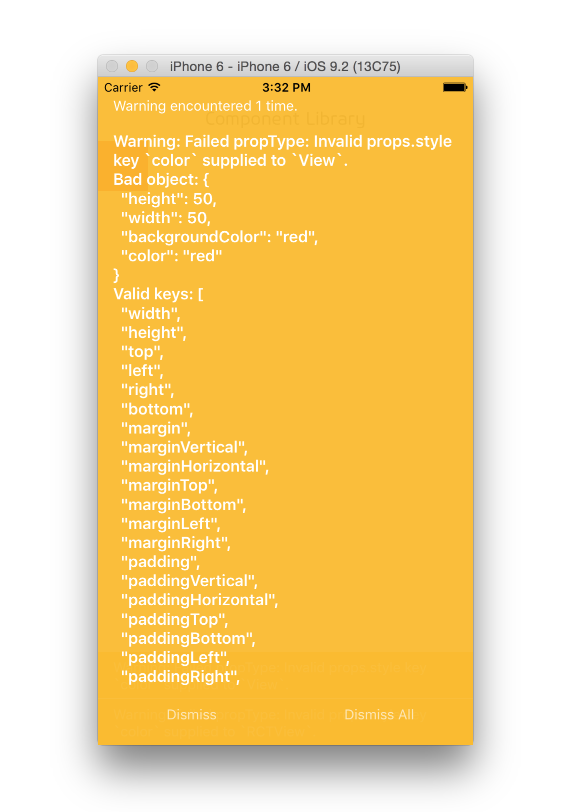
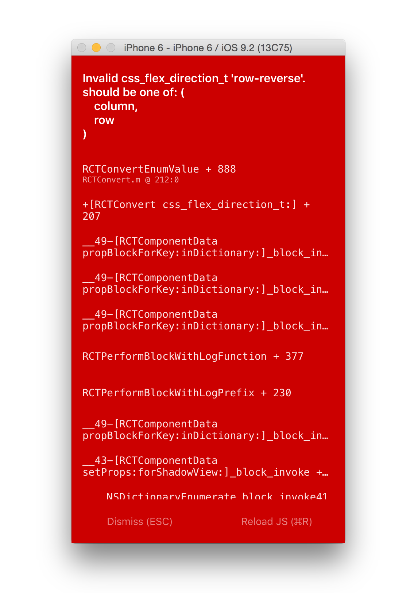
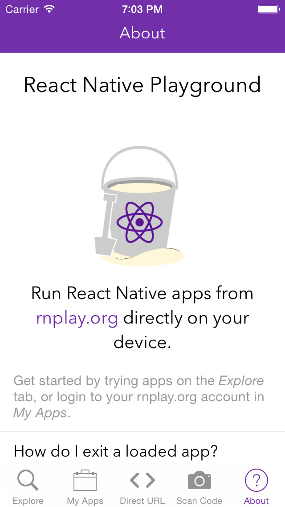

# [fit] `$ git commit -m "Add styles" --author="Jan Maršíček"`

---

# Kdo, co, proč?

- **Jan Maršíček**
jmarsicek@blueberryapps.com
twitter.com/janmarsicek
github.com/janmarsicek
- **stylování mobilních aplikací**
- **nová role kodéra** při vývoji mobilních aplikací

---

# [fit] Jak se stylují
## [fit] mobilní aplikace?

---

# [fit] **V hlavní roli:**
# [fit] Programátor

---


---

# [fit] React Native

---

# [fit] Mobile development for web developers

---

# Focus na produkt

---

# [fit] From React To React Native in 30 minutes


---

# [fit] From React To React Native in 5 minutes


---

# Jaké to je pro kodéra?

---

# CSS in JS

---

# CSS in JS


---

# CSS in JS

- **Locally scoped class names**
  - CSS Modules
  - Aphrodite

- **Inline styles**
  - Radium
  - React Look

---



---

# Radium
- **Výhody**
  - vše je v Javascriptu
  - styly jsou u komponenty
  - dynamické výpočty/state komponenty
  - odstraňování nepoužívaného kódu
  - testovatelnost vizuální stránky
  - explicitní


---

- explicitní

```js
<button
  style={[
    styles.base,
    styles[this.props.kind],
    this.props.disabled && styles.disabled
  ]}
>
...
```

---

# Radium
- **Nevýhody**
  - pomalé hovery
  - server-rendering
  - nedostupné CSS selektory (např. div > p, div + div, :nth-child(n), :before, :after...)


---

# [fit] Stejný způsob pro web
# [fit] a React Native

---

# StyleSheet

**StyleSheet.create({})**

```js
const styles = StyleSheet.create({
  base: {
    width: 38,
    height: 38,
  },
  background: {
    backgroundColor: '#222222',
  },
  active: {
    borderWidth: 2,
    borderColor: '#00ff00',
  }
});
```

---

# Specifika

- subset vlastností
- subset hodnot

<br>
**Packages**

- [react-native-extended-stylesheet](https://github.com/vitalets/react-native-extended-stylesheet)
- [react-native-css](https://github.com/sabeurthabti/react-native-css), [Cairn](https://github.com/adamterlson/cairn) *etc.*

---

```js
const styles = StyleSheet.create({
  background: {
    primary: {
      backgroundColor: 'green'
    },
    secondary: {
      backgroundColor: 'blue'
    }
  }
});
```

- 😡
`style={styles.background.primary}`

---

# nepodporuje `zkrácený` zápis

- 😡

```js
  border: '1px solid black'
```

<br>

- 😀

```js
  borderColor: 'black',
  borderStyle: 'solid',
  borderWidth: 1
```

---

# nepodporuje `zkrácený` zápis

- 😡

```js
  boxShadow: '0 2px 5px rgba(0, 0, 0, .5)'
```

<br>

- 😀

```js
  shadowOffset: {width: 0, height: 2},
  shadowColor: 'black',
  shadowOpacity: .5,
  shadowRadius: 5
```

---

# Aplikace stylů na elementy

```js
<Text style={{color: 'red'}}>Ahoj</Text>
<Text style={styles.text}>Ahoj</Text>
<View style={[styles.base, styles.background]} />
<View style={[
  styles.base,
  this.state.active && styles.active]}
/>
```

---

# CSS Layout

- [css-layout](https://github.com/facebook/css-layout)
  - box-sizing: border-box
  - position: relative
  - display: flex

---

# Flexbox

- nový způsob pro tvorbu layoutů pomocí CSS
- intuitivní
- Auto Layout

---

# Flexbox

- **neúplná implementace**
- chybí vlastnosti a hodnoty pro **změnu pořadí**
  - `order: 1`
  - `flexDirection: 'row-reverse'`

---

# Kde se naučit s flexboxem?

- [What The FlexBox?!](http://flexbox.io/) *(video tutorial)*
- [Flexbox Playground](https://demos.scotch.io/visual-guide-to-css3-flexbox-flexbox-playground/demos/) *(vizuální průvodce)*
- [Flexbox Defense](http://www.flexboxdefense.com/) *(interaktivní výuka)*
- [Flexbox Froggy](http://flexboxfroggy.com/) *(interaktivní výuka)*
- [A Complete Guide to Flexbox](https://css-tricks.com/snippets/css/a-guide-to-flexbox/) *(referenční příručka)*
- [Flexbox in 5 minutes](flexbox in 5 minutes) *(interaktivní průvodce)*

---

# [fit] React Native komponenty

---



---




---

# <Text />

- dědění stylů

```js
<Text style={{fontSize: 20}}>
  Ahoj <Text style={{color: 'blue'}}>lidi</Text>
</Text>
```

---

# 💪 🍺 🚀 🍕 👌 😎

---

# <Image />

```
<Image
  style={styles.myIcon}
  source={require('./myIcon.png')}
/>

<Image
  style={styles.reactLogo}
  source={{uri: 'http://facebook.github.io/react/img/logo_og.png'}}
/>
```

---

# <Image />

- **source**
  lokální soubory nebo URL
- **resizeMode**
  `enum('cover', 'contain', 'stretch')`
- **přípony**
  `@2x.png, @3x.png`
  `.ios.png, .android.png`

---

# Background Image

```
<Image
  resizeMode='cover'
  source={{uri: 'http://i.imgur.com/BdKjoDw.png'}}
  style={styles.wrapper}
>
  <Text style={styles.beerIcon}>🍺</Text>
  <Text style={styles.text}>#blueberryMeetup</Text>
  <Text style={styles.sub}>2016/06/28 @ Node5</Text>
</Image>
```


---

Square.react.js

```js
import colors from '../styles/colors';
import layout from '../styles/layout';
//...
<View styles={[layout.centeredView, styles.base]} />
//...
const styles = StyleSheet.create({
  base: {
    backgroundColor: colors.primary,
    height: 50,
    width: 50
  },
  //... some other styles
})
```

---

# Platform specific styles

- zanedbatelné rozdíly mezi iOS a Android
- custom fonty
- ikony aplikace

---

# Hot reloading

---


# **React Native** Playground

---

# React Native Playground

* **[rnplay.org](http://rnplay.org)**
* nejjednodušší způsob, jak vyzkoušet kód
* pomocí QR kódu lze ukázku přenést do zařízení
* Appetize.io



---

# Jaké to bylo?

* lepší pochopení toho, jak funguje React
* inline styly
* první PR do open source 😉

---

# [fit] ?
